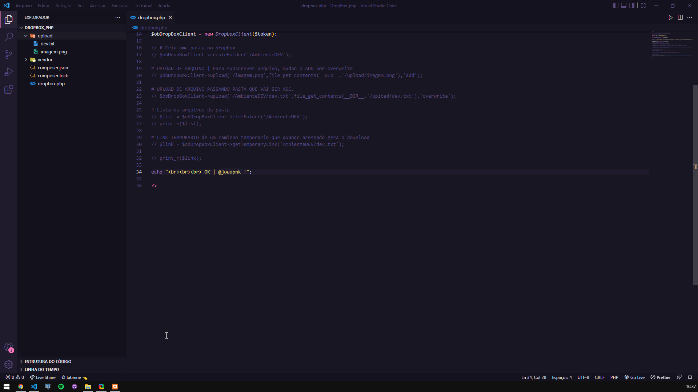

## [PHP] UPLOAD FILES BY PHP TO DROPBOX </h2>

[PT-BR]💻 Envio de arquivos via PHP para o DropBox de forma prática

<h5>❗ ATENÇÃO: Lembre-se de colocar  o seu $TOKEN, só assim o upload ira funcionar ❗</h5>

<h3>🚀 Tecnologias utilizadas </h3>
<ul>
  <li> PHP </li>
</ul>

[ ENG ]💻 Upload files by php to dropbox

<h5>❗ ATTENTION: Remember to put your $TOKEN, only then will the upload work ❗</h5>

<h3>🚀 Technologies used </h3>
<ul>
  <li> PHP </li>
</ul>

<h3>Preview:</h3>
<h4>[PT-BR] No preview, realizo a criação de uma pasta, o envio de um arquivo .txt, listagem de todos os arquivos que existem naquela pasta e também um link temporário de download para o arquivo informado.</h4>
<h4>[ ENG ] In the preview, I create a folder, send a .txt file, list all the files that exist in that folder and also provide a temporary download link for the informed file.</h4>

